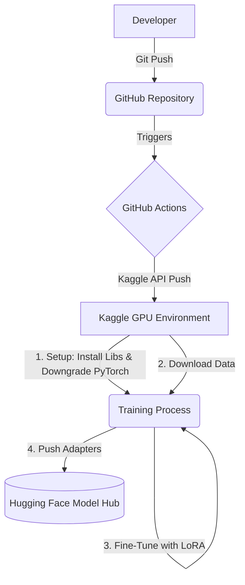

# DeAIze Automated Fine-Tuning Pipeline

Welcome to the **DeAIze** training infrastructure repository! 

## Purpose of this Project
This project was created as a personal learning exercise to familiarize myself with building a fully automated Continuous Integration and Continuous Deployment (CI/CD) pipeline for fine-tuning Large Language Models (LLMs). 

> **Note:** As this is my first project exploring MLOps and LLM fine-tuning, the codebase (including the training notebook and GitHub Actions workflows) was mostly **AI-generated**. It serves as a practical, working example of how to connect various AI platforms together.

## The Automated Workflow
This repository automates the entire process of training a model from a simple git push, without needing to manually spin up servers. 

Here is how the pipeline works:
1. **Trigger:** Whenever new code or training data (`dataset.json`) is pushed to the `main` branch on GitHub, a GitHub Actions workflow is triggered.
2. **Compute Allocation (Kaggle):** The GitHub Action uses the Kaggle API and `kernel-metadata.json` to automatically push the code to Kaggle and request a backend GPU instance (Tesla P100).
3. **Fine-Tuning:** The Kaggle container runs `train.ipynb`, which loads the base model (`Qwen/Qwen2.5-3B-Instruct`), applies LoRA (Low-Rank Adaptation) via the `peft` library, and trains the model in FP16 precision using the `trl` library's `SFTTrainer`.
4. **Deployment (Hugging Face):** Once training completes, the notebook automatically uploads the finalized LoRA adapter weights directly to the Hugging Face Model Hub.

## Model Purpose & Dataset Details
* **Objective:** The specific goal of this fine-tuned model is to edit AI-generated text to match my own personal writing style. It is designed to remove "robotic AI-isms" and repetitive transitions, making the text sound naturally like *me*. Because of this highly personalized goal, the output is not meant to be strictly "professional" or suitable for general-purpose use.
* **Target Language:** The dataset and model outputs are entirely in **Vietnamese**, tailored specifically for Vietnamese users and text.
* **Dataset Status:** The training data (`dataset.json`) is entirely hand-crafted by me based on my own writing. Currently, it contains only a small number of examples as a proof-of-concept for the pipeline. I will be gradually adding more examples over time to continuously improve the model's ability to capture my unique voice.

## Links & Resources
* **Kaggle Notebook / Execution Logs:** [deaize-training-infrastructure](https://www.kaggle.com/code/youmei1/deaize-training-infrastructure)
* **Hugging Face Model (Adapters):** [Youmei295/deAIze](https://huggingface.co/Youmei295/deAIze)
